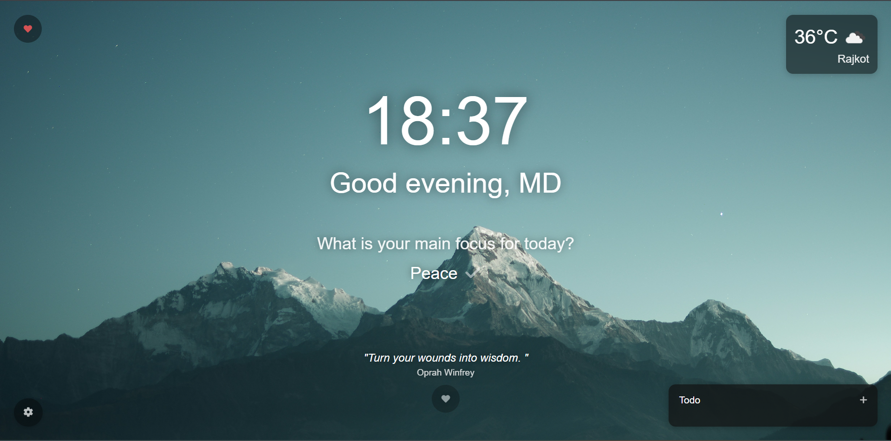
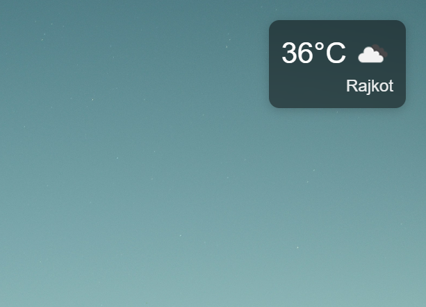
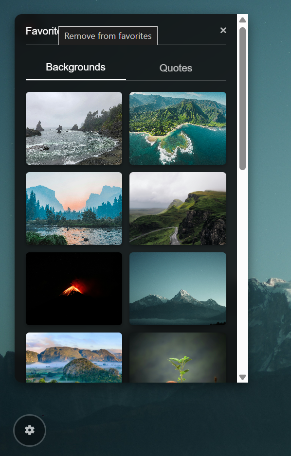
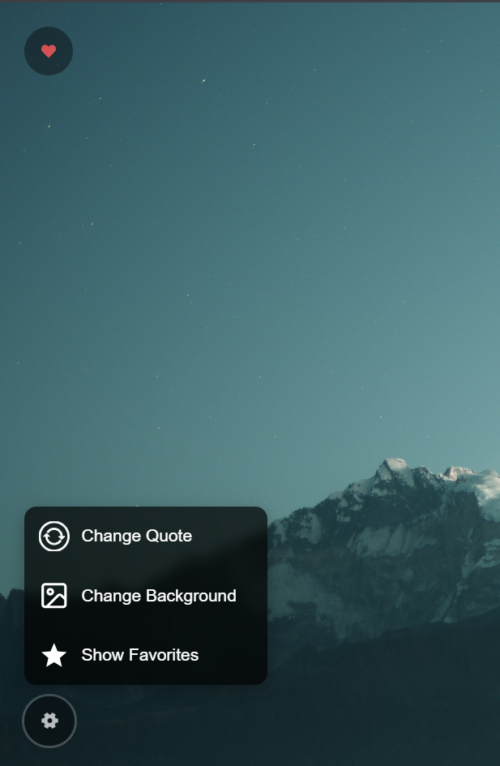

# MyTab - Chrome Extension

A beautiful and functional Chrome extension that replaces your new tab page with a personalized dashboard featuring time, weather, inspirational quotes, and productivity tools.

## 🌟 Features

### 🕐 **Time & Greeting**
- Real-time clock display
- Personalized greetings based on time of day
- Focus tracker - set and track your main goal for the day

### 🌤️ **Weather Information**
- Current weather conditions with temperature
- Location-based weather using geolocation
- Detailed weather information including:
  - Wind speed
  - Humidity levels
  - "Feels like" temperature
  - Weather forecast

### 📝 **Todo List**
- Add and manage daily tasks
- Mark tasks as complete
- Persistent storage across browser sessions
- Clean, intuitive interface

### 💭 **Inspirational Quotes**
- Daily inspirational quotes from ZenQuotes API
- Refresh quotes manually
- Save favorite quotes for later
- Beautiful typography and presentation

### 🖼️ **Dynamic Backgrounds**
- High-quality landscape photos from Unsplash
- Automatic background rotation
- Manual background refresh
- Save favorite backgrounds
- Organized favorites with tabs (Backgrounds & Quotes)

### ⚙️ **Customization Options**
- Settings menu with easy access to all features
- Favorites management system
- Responsive design that works on all screen sizes

## 📸 Screenshots

### Main Dashboard


*The main new tab page showing time, weather, todo list, and inspirational quote*

### Weather Details


*Expanded weather view with detailed information and forecast*

### Favorites Panel


*Favorites management panel with saved backgrounds and quotes*

### Settings Menu


*Settings dropdown with customization options*

## 🚀 Installation

### From Source (Developer Mode)

1. **Download or Clone the Repository**
   ```bash
   git clone https://github.com/mayurtholiya/MyTabChromeExtension.git
   cd MyTabChromeExtension
   ```

2. **Setup API Keys**
   - Open `script.js`
   - Replace `___Key___` placeholders with your actual API keys:
     - **Unsplash Access Key**: Get from [Unsplash Developers](https://unsplash.com/developers)
     - **OpenWeatherMap API Key**: Get from [OpenWeatherMap](https://openweathermap.org/api)

3. **Load Extension in Chrome**
   - Open Chrome and navigate to `chrome://extensions/`
   - Enable "Developer mode" (toggle in top-right corner)
   - Click "Load unpacked"
   - Select the extension folder
   - The extension should now be loaded and active

4. **Permissions Setup**
   - Grant location permission when prompted (for weather feature)
   - The extension will automatically replace your new tab page

## 🔧 Configuration

### API Keys Required

1. **Unsplash API** (for background images)
   - Sign up at [Unsplash Developers](https://unsplash.com/developers)
   - Create a new application
   - Copy the Access Key

2. **OpenWeatherMap API** (for weather data)
   - Sign up at [OpenWeatherMap](https://openweathermap.org/api)
   - Get your free API key
   - Copy the API key

### File Structure
```
├── manifest.json          # Extension manifest
├── newtab.html            # Main new tab page HTML
├── script.js              # Main JavaScript functionality
├── styles.css             # Styling and layout
├── background.js          # Service worker for background tasks
├── icons/                 # Extension icons
│   ├── icon16.png
│   ├── icon48.png
│   ├── icon128.png
└── README.md              # This file
```

## 🛠️ Technical Details

### Built With
- **HTML5** - Structure and layout
- **CSS3** - Styling with modern features
- **Vanilla JavaScript** - No external frameworks
- **Chrome Extension Manifest V3** - Latest extension standards

### APIs Used
- **Unsplash API** - High-quality background images
- **OpenWeatherMap API** - Weather data and forecasts
- **ZenQuotes API** - Inspirational quotes
- **Chrome Storage API** - Local data persistence
- **Geolocation API** - Location-based weather

### Browser Compatibility
- **Chrome** 88+ (Manifest V3 support required)
- **Chromium-based browsers** (Edge, Brave, etc.)

## 🔒 Privacy & Permissions

### Required Permissions
- **Storage** - Save your todos, favorites, and preferences locally
- **Geolocation** - Get your location for accurate weather information
- **Host Permissions** - Access to ZenQuotes API for inspirational quotes

### Data Handling
- All personal data (todos, favorites) is stored locally in your browser
- No personal information is sent to external servers
- Location data is only used for weather API calls
- API keys should be kept secure and not shared

## 🎨 Customization

### Modifying Background Sources
Edit the `CONFIG.UNSPLASH_API.QUERY` in `script.js` to change photo categories:
```javascript
QUERY: 'nature,landscape,coastal' // Change to your preferred categories
```

### Adjusting Update Intervals
Modify cache durations in the `CONFIG` object:
```javascript
CACHE_DURATION: 1 * 60 * 60 * 1000, // 1 hour in milliseconds
```

## 🤝 Contributing

1. Fork the repository
2. Create a feature branch (`git checkout -b feature/amazing-feature`)
3. Commit your changes (`git commit -m 'Add some amazing feature'`)
4. Push to the branch (`git push origin feature/amazing-feature`)
5. Open a Pull Request

## 📝 Todo / Future Features

- [ ] Multiple theme options
- [ ] Additional weather providers
- [ ] Custom background upload
- [ ] Export/import settings
- [ ] More quote sources
- [ ] Pomodoro timer integration
- [ ] Calendar integration
- [ ] Bookmark shortcuts

## 🐛 Known Issues

- Weather may not load if geolocation is denied
- API rate limits may affect background/quote refresh frequency
- Some corporate networks may block external API calls

## 📄 License

This project is licensed under the MIT License - see the [LICENSE](LICENSE) file for details.

## 🙏 Acknowledgments

- **Unsplash** - For providing beautiful, high-quality images
- **OpenWeatherMap** - For reliable weather data
- **ZenQuotes** - For inspirational daily quotes
- **Font Awesome** - For beautiful icons

**Made with ❤️ for productivity and inspiration**
# MyTabChromeExtension
It's a Chrome Extension to customize Chrome's New Tab just like Momentum
